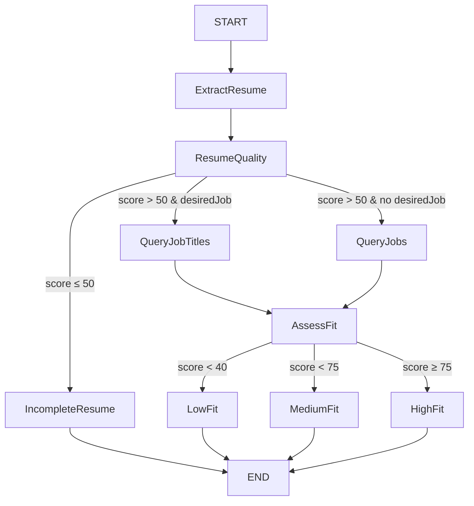

# Resume Radar: Agentic Job Match Analyzer

## Overview

Resume Radar is an agent-based web application that analyzes your resume and matches you to relevant job opportunities using advanced AI and semantic search. The system leverages a multi-node agentic workflow, vector embeddings, and a modern React front-end to deliver personalized career insights and recommendations.

---

## Problem Domain

Job seekers often struggle to understand how well their resume fits specific roles, what skills they lack, and which jobs they are best suited for. Traditional keyword-based matching is limited and fails to capture nuanced fit. Resume Radar solves this by:

- Parsing resumes for structured data (skills, experience, education)
- Using semantic search (RAG) to find jobs and titles that best match your profile
- Assessing resume quality and job fit
- Providing actionable advice and improvement recommendations

---

## Agentic System Architecture

The backend agent is implemented using LangGraph and consists of several interconnected nodes, each responsible for a distinct reasoning or tool-calling step. The agent maintains a persistent state object, passing it between nodes to track progress and results.

### Node Graph

---
